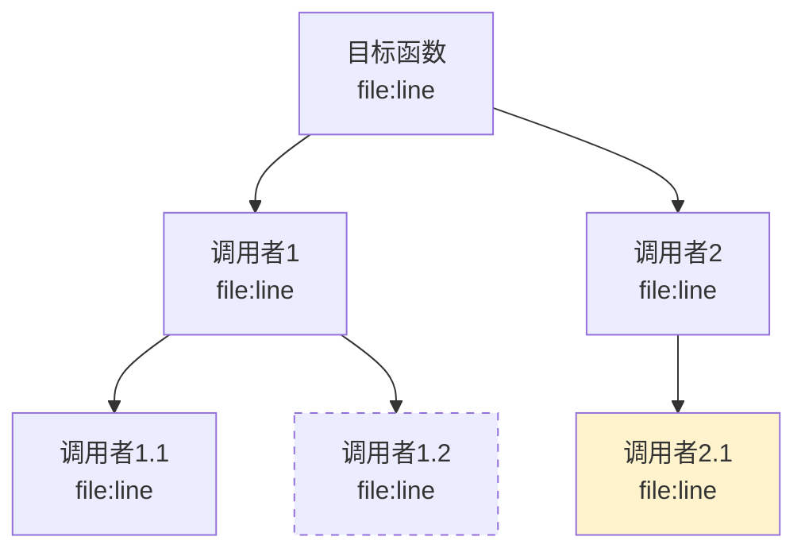

# module-analyzer Implementation Plan

> **For agentic workers:** REQUIRED SUB-SKILL: Use superpowers:subagent-driven-development (recommended) or superpowers:executing-plans to implement this plan task-by-task. Steps use checkbox (`- [ ]`) syntax for tracking.

**Goal:** Create a new `module-analyzer` skill that generates function-level module design documents and impact analysis for internal C/C++ projects (~200K lines per module), running on opencode + clangd.

**Architecture:** Two-mode skill — mode one generates a structured module design document from a directory path; mode two traces function-level impact from a function name. Both modes leverage clangd LSP for precise `goToDefinition`/`findReferences` calls. Analysis uses subagent parallelism for 200K-line modules, with layered dependency output (core functions get full call chains, helpers get directory listing only).

**Tech Stack:** Skill format (SKILL.md + references), clangd LSP, Mermaid diagrams, subagent parallel analysis

---

## File Structure

```
skills/module-analyzer/
├── SKILL.md                              # Main skill: two-mode entry, workflow definition
└── references/
    ├── dependency-analysis-guide.md      # LSP-based function-level dependency methodology
    └── impact-analysis-guide.md          # Impact analysis mode: tracing, propagation, suggestions
```

No changes to existing `skills/repo-analyzer/` — this is an independent skill.

---

### Task 1: Create skill directory structure

**Files:**
- Create: `skills/module-analyzer/references/` (directory)

- [ ] **Step 1: Create directory**

Run: `mkdir -p skills/module-analyzer/references`

- [ ] **Step 2: Verify structure**

Run: `find skills/module-analyzer -type d`
Expected:
```
skills/module-analyzer
skills/module-analyzer/references
```

- [ ] **Step 3: Commit**

```bash
git add skills/module-analyzer/
git commit -m "chore: create module-analyzer skill directory structure"
```

---

### Task 2: Write the main SKILL.md

This is the core deliverable. It defines the two-mode workflow, interaction model, and coordinates subagents.

**Files:**
- Create: `skills/module-analyzer/SKILL.md`

- [ ] **Step 1: Write SKILL.md with frontmatter and mode routing**

```markdown
---
name: module-analyzer
description: Use when the user wants to analyze a specific module in a large C/C++ project — generate module design documentation with function-level dependency mapping, or trace the impact of changing a specific function. Triggers on "分析模块" "模块设计文档" "模块文档" "依赖梳理" "影响分析" "改动影响" "函数调用链" "谁调用了" "调用关系" "模块分析" "生成模块文档"
---

# C/C++ 模块深度分析技能

面向内部大型 C/C++ 项目的模块级分析工具。两种模式：根据目录路径生成模块设计文档，或根据函数名做影响面分析。

## 模式识别

根据用户输入自动判断模式：

**模式一：模块设计文档**
- 触发条件：用户提供目录路径（如 `src/network/http/`、`modules/auth`）
- 目标：生成完整的模块设计文档
- 交互：轻交互，扫描后问 1-2 个问题确认方向

**模式二：影响面分析**
- 触发条件：用户提供函数名（如 `HttpServer::handleRequest`、`parse_config`）
- 目标：追踪调用链、影响传播、给出改动建议
- 交互：确认影响追踪范围

如果输入同时包含目录和函数名，优先走模式一。

## 输出语言

默认中文。如果用户使用其他语言提问，则跟随用户语言。

## 输出位置

所有输出保存到 `~/repo-analyses/{module-name}-{YYYYMMDD}/` 目录。

## 前置条件

- 运行环境需配置 clangd LSP
- LSP 需能正常响应 `goToDefinition`、`findReferences`、`hover` 请求
- 如果 LSP 不可用，agent 应在启动时警告用户，并降级到 grep 模式（精度降低）

## 核心原则

### 1. 函数级精度

所有依赖关系和调用链必须精确到函数级别，标注源文件路径和行号。使用 clangd LSP 作为主要分析工具：

| 操作 | LSP 方法 | 用途 |
|------|---------|------|
| 查找函数定义 | `goToDefinition` | 从调用点定位实现 |
| 查找所有调用者 | `findReferences` | 反向依赖追踪 |
| 查找接口实现 | `findImplementations` | 虚函数/回调追踪 |
| 获取函数签名 | `hover` | 提取参数类型和返回值 |
| 获取文件符号 | `documentSymbol` | 列出文件内所有函数 |

### 2. LSP 优先，grep 兜底

- **第一步总是尝试 LSP**——它能理解编译上下文、宏展开、条件编译
- **LSP 失败时降级到 grep**——用正则匹配函数调用模式，结果需标注"未经验证"
- 两种来源的结论需标注来源：`[LSP]` 或 `[grep]`

### 3. 分层输出

核心函数展开完整分析，辅助函数只列目录。判断标准：
- **核心函数**：在主业务流程路径上、被多个外部模块调用、调用链深度 >= 3
- **辅助函数**：工具函数、getter/setter、简单的错误处理封装

### 4. 代码为准，标注溯源

- 每个结论必须标注源文件路径和行号：`src/http/parser.c:142-168`
- 所有函数调用关系必须通过 LSP 验证，不允许仅凭命名推断
- Mermaid 图中每个节点标注文件路径

---
```

- [ ] **Step 2: Append Mode One workflow to SKILL.md**

```markdown
## 模式一：模块设计文档工作流

### 阶段 M1: 目录扫描与结构识别

1. 验证用户提供的目录路径存在
2. 统计目录下的文件和代码规模：
   - 文件数量（.c/.cpp/.h/.hpp 分别统计）
   - 有效代码行数（排除空行和注释）
   - 子目录结构
3. 使用 `documentSymbol` 扫描所有源文件，提取函数/类型定义列表
4. 识别模块边界信号：
   - 公共头文件（被模块外文件 include 的头文件）
   - 内部头文件（只被模块内 include 的头文件）
   - 入口函数候选（非 static、被模块外调用的函数）

### 阶段 M2: 轻交互确认

基于扫描结果，使用 AskUserQuestion 向用户确认（最多 2 个问题）：

1. **入口函数确认**：列出识别到的入口函数候选，让用户确认或补充。问题示例：
   > "扫描到以下可能作为模块入口的函数：
   > - `http_server_start()` — server.c:45
   > - `http_server_handle_request()` — handler.c:12
   > 请确认主要入口函数，或补充我遗漏的。"

2. **分析重点确认**（如入口函数已很明确则可跳过）：
   > "模块包含 {n} 个源文件，{m} 个函数。你希望完整分析所有子模块，还是有特定关注的子模块？"

### 阶段 M3: 函数级依赖梳理

**这是核心阶段，大量使用 LSP。**

#### 3.1 公开接口识别

识别模块的公开接口（对外暴露的函数/类型）：

1. **公共头文件法**：查找被模块外 `.c` 文件 `#include` 的头文件，提取其中声明的函数
2. **static 过滤法**：排除所有 `static` 函数——这些是模块内部实现
3. **LSP 验证**：对每个候选公开函数，用 `findReferences` 确认是否有模块外的调用者
4. 结果分为：`[公开接口]`、`[内部实现]`、`[待确认]`

#### 3.2 核心函数识别

从所有函数中识别核心函数：

1. 对每个非 static 函数用 `findReferences` 统计被调用次数
2. 对入口函数用 LSP 追踪调用链深度（递归追踪 3 层）
3. 标记规则：
   - 被外部模块调用 >= 2 次 → 标记为核心
   - 在入口函数的调用链上 → 标记为核心
   - 调用链深度 >= 3 → 标记为核心
   - 其余 → 标记为辅助

#### 3.3 依赖关系构建

对每个核心函数：

1. **正向依赖**（它调用了谁）：从函数体中定位所有函数调用点，用 `goToDefinition` 确认目标函数
2. **反向依赖**（谁调用了它）：用 `findReferences` 找所有调用点
3. **外部依赖边界**：调用到模块外的函数时，记录调用点和目标函数签名，用 `[跨模块]` 标注，不继续深入
4. 将结果构建为依赖图数据，用于后续 Mermaid 图生成

对辅助函数：只记录函数签名和一句话职责（通过 `hover` 获取），不展开调用链。

### 阶段 M4: 端到端流程梳理

从用户确认的入口函数出发，追踪完整调用链：

1. 从入口函数开始，按调用顺序递归展开核心函数调用
2. 对每个分支标注：
   - 函数名 + 文件路径:行号
   - 调用条件（如 `if (error) goto cleanup` 中的错误处理分支）
3. 在模块边界处标注上下游：
   - `[上游: xxx_module::yyy()]` — 数据从哪来
   - `[下游: zzz_module::www()]` — 数据传给谁
4. 生成 Mermaid 时序图/流程图

### 阶段 M5: 并行深度分析（subagent 团队）

如果模块 > 50000 行，使用 Agent 工具并行启动 subagent 分析子模块。

#### 调度策略

- 按子目录或功能聚类划分子模块（每个子模块 1-3 万行为宜）
- 每个子模块 → 一个独立 Agent subagent（`subagent_type: "general-purpose"`）
- 所有 subagent 在同一消息中并行启动

#### Subagent Prompt 要点

每个 subagent 必须获得：
- 模块整体设计哲学和架构概览
- 该子模块的文件范围
- 该子模块在整体中的位置（上游/下游模块）
- 公开接口列表（已从阶段 M3 获得）
- LSP 使用指令和覆盖率要求
- 叙事上下文（前一个子模块讲了什么、本模块需要铺垫什么）

#### 主 Agent 等待纪律

- subagent 启动后，主 agent 不阅读 subagent 负责的源码
- 等待期间可准备报告骨架、处理外部依赖分析
- 所有 subagent 完成后才开始合并

### 阶段 M6: 质量验证

1. **覆盖率检查**：读取每个草稿末尾的覆盖率明细表，未达标的模块由主 agent 补充阅读
2. **LSP 结论抽查**：从每个子模块选取 2-3 个调用关系，回到源码验证准确性
3. **依赖图一致性**：检查跨子模块的调用关系是否一致（A 说调用了 B，B 的反向依赖里有没有 A）

### 阶段 M7: 文档生成

将所有分析结果融合为一份完整文档，8 个章节。写入 `$WORK_DIR/MODULE_DESIGN.md`。

文档结构：

```markdown
# {模块名} 模块设计文档

生成时间: {date}
分析范围: {目录路径}
代码规模: {文件数} 文件, {有效代码行数} 行

## 1. 模块概览
- 在系统中的角色（一句话）
- 目录结构树
- 核心职责列表

## 2. 核心数据结构
- 关键 struct/enum/typedef 定义
- 字段含义和设计意图
- 数据结构之间的关系

## 3. 函数索引
### 公开接口
| 函数 | 文件:行号 | 职责 | 调用者数量 |
|------|----------|------|-----------|
### 内部核心函数
| 函数 | 文件:行号 | 职责 | 调用链深度 |
|------|----------|------|-----------|
### 辅助函数
| 函数 | 文件:行号 | 一句话描述 |
|------|----------|-----------|

## 4. 函数级依赖图
- Mermaid 图：核心函数调用关系
- 跨模块调用用虚线标注，附目标模块和函数名
- 图例说明

## 5. 外部依赖
### 依赖的模块
| 模块 | 调用方式 | 关键调用点 |
|------|---------|-----------|
### 依赖的系统库
| 库 | 用途 | 使用位置 |
|----|------|---------|

## 6. 被依赖方（谁在用这个模块）
| 调用方模块 | 调用的函数 | 调用位置 |
|-----------|-----------|---------|

## 7. 端到端流程梳理
- 从入口函数到出口的完整调用链
- Mermaid 流程图
- 关键分支和错误处理路径
- 上下游模块边界标注

## 8. 关键设计决策
- 每个重大设计选择：选了什么、没选什么、为什么
- 权衡分析
- 改进建议（如有）
```

### 草稿文件

所有中间过程保存到 `$WORK_DIR/drafts/`：

| 阶段 | 文件 |
|------|------|
| M3 | `M3-dependencies.md`（依赖梳理结果） |
| M4 | `M4-flows.md`（端到端流程草稿） |
| M5 | `M5-submodule-{name}.md`（subagent 生成） |
| M6 | `M6-validation.md`（验证记录） |

---
```

- [ ] **Step 3: Append Mode Two workflow to SKILL.md**

```markdown
## 模式二：影响面分析工作流

### 阶段 I1: 函数定位

1. 解析用户输入的函数名（支持 `Class::method`、`function_name`、`namespace::function` 格式）
2. 使用 `workspaceSymbol` 搜索函数定义位置
3. 如果找到多个定义（重载、不同文件），列出所有候选让用户选择
4. 使用 `hover` 获取完整函数签名（参数类型、返回值）

### 阶段 I2: 轻交互确认

使用 AskUserQuestion 确认分析范围（1 个问题）：

> "定位到函数 `{function_signature}`（`{file}:{line}`）。
> 影响追踪深度：
> - A) 仅直接调用者（一层）
> - B) 递归追踪 3 层
> - C) 完整传播链（尽可能深）"

### 阶段 I3: 调用链追踪

#### 正向追踪（它调用了谁）

1. 读取函数体，识别所有函数调用点
2. 对每个调用点用 `goToDefinition` 定位目标函数
3. 递归展开目标函数的调用（按用户选择的深度）
4. 记录每个节点的：函数签名、文件路径:行号、调用条件

#### 反向追踪（谁调用了它）

1. 用 `findReferences` 找到所有调用点
2. 对每个调用者，获取其函数签名和定义位置
3. 递归追踪调用者的调用者（按用户选择的深度）
4. 记录调用上下文（在什么条件下被调用）

#### 影响传播树

综合正反向追踪结果，构建影响传播树：

```
影响函数: HttpServer::handleRequest (handler.c:142)
├── [直接调用者] Connection::processRequest (connection.c:89)
│   └── [间接调用者] EventLoop::handleEvent (event.c:234)
│       └── [间接调用者] main (main.c:45)
├── [直接调用者] HttpServer::handleUpgrade (upgrade.c:28)
│   └── [间接调用者] Server::start (server.c:67)
└── [直接调用者] TestHarness::testRequest (test_handler.c:12) [测试代码]
```

### 阶段 I4: 影响分析与改动建议

基于调用链追踪结果：

1. **影响面评估**：
   - 影响的模块数量和列表
   - 影响的调用路径数量
   - 是否涉及关键路径（频繁调用的核心逻辑）

2. **改动风险分析**：
   - 修改函数签名（参数变化）→ 所有调用者都需要改
   - 修改返回值语义 → 所有使用返回值的地方需要检查
   - 修改内部行为（不改接口）→ 只有依赖行为语义的调用者受影响
   - 添加新参数（带默认值）→ 风险最低

3. **改动建议**：
   - 推荐的修改方式（最小影响面）
   - 需要同步修改的文件列表（带行号）
   - 建议新增的测试点

### 阶段 I5: 输出

直接在对话中输出分析结果（不生成文件，或保存到 `$WORK_DIR/impact-{function-name}.md`）。

输出格式：

```markdown
# 影响分析: {函数签名}

定义位置: `{file}:{line}`
分析时间: {date}

## 调用链

### 正向依赖（它调用了谁）
{Mermaid 图或文本树}

### 反向依赖（谁调用了它）
{Mermaid 图或文本树}

## 影响传播树
{完整传播树}

## 影响面评估
- 影响模块: {n} 个
- 影响调用路径: {m} 条
- 是否关键路径: {是/否}

## 改动建议
### 如果修改函数签名
- 需要同步修改的调用者: {列表}
- ...

### 如果修改返回值语义
- 需要检查的使用方: {列表}
- ...

### 如果修改内部行为
- 依赖行为语义的调用者: {列表}
- ...

## 建议新增的测试点
- ...
```

---

## 通用规范

### LSP 使用规范

- **每次 LSP 调用必须检查返回值**——clangd 可能返回空结果（编译数据库未覆盖、条件编译分支）
- **LSP 超时处理**——单次 LSP 调用超过 5 秒视为超时，降级到 grep 并标注
- **结果去重**——`findReferences` 可能返回同一行的多个结果（宏展开），需要去重
- **跨文件追踪**——调用链跨越到模块外时，记录边界信息但不再深入

### 大模块处理策略

- 单文件 > 5000 行：分段读取（前 100 行类型定义 + import、核心函数按 `documentSymbol` 定位）
- 模块总代码 > 50000 行：启动 subagent 并行分析
- subagent 之间通过草稿文件通信，主 agent 负责合并
- 覆盖率要求：核心函数 >= 90%，辅助函数 >= 50%

### Mermaid 图规范

- 依赖图用 `graph TD`（从上到下），节点格式：`函数名\n文件:行号`
- 端到端流程用 `sequenceDiagram` 或 `flowchart TD`
- 跨模块调用用虚线 `-.->` 并标注 `[跨模块] 模块名::函数名`
- 每张图不超过 30 个节点，超出时分拆为多张图
```

- [ ] **Step 4: Verify SKILL.md completeness**

Run: `wc -l skills/module-analyzer/SKILL.md`
Expected: ~280-350 lines

Run: `head -5 skills/module-analyzer/SKILL.md`
Expected: frontmatter with `name: module-analyzer`

- [ ] **Step 5: Commit**

```bash
git add skills/module-analyzer/SKILL.md
git commit -m "feat: add module-analyzer SKILL.md with two-mode workflow"
```

---

### Task 3: Write dependency-analysis-guide.md

This reference file provides detailed methodology for LSP-based function-level dependency analysis — the "how-to" that subagents and the main agent follow during Mode One's Phase M3.

**Files:**
- Create: `skills/module-analyzer/references/dependency-analysis-guide.md`

- [ ] **Step 1: Write dependency-analysis-guide.md**

```markdown
# 函数级依赖分析指南

## LSP 工具使用手册

### goToDefinition — 定位函数实现

**用途**：从函数调用点跳转到函数定义处。

**操作流程**：
1. 在源码中找到函数调用点（通过 Read 工具读取文件，定位行号）
2. 对调用点使用 `goToDefinition`，传入文件路径、行号、列号（列号应指向函数名的起始字符）
3. 返回结果中获取定义的文件路径和行号

**注意事项**：
- 函数指针调用和回调场景，`goToDefinition` 可能跳转到类型定义而非实际被调用的函数。此时需结合上下文判断（赋值语句、注册回调的代码）
- 宏封装的调用（如 `LOG_INFO(...)` 展开后可能不是函数调用）需先确认是否为宏
- 条件编译（`#ifdef`）内的调用，LSP 可能无法正确定位，需要 grep 兜底

### findReferences — 查找所有引用

**用途**：找到某个函数被调用的所有位置（反向依赖）。

**操作流程**：
1. 在函数定义处（非声明处）使用 `findReferences`
2. 返回结果中筛选类型：只关注 `reference` 类型（排除 `definition`、`declaration`）
3. 对每个引用点提取：所在函数名（通过 `documentSymbol` 反查）、文件路径、行号

**注意事项**：
- 函数重载时，`findReferences` 可能混入同名但不同签名的引用，需检查参数数量/类型
- 模板函数/函数模板的引用可能分布在多个实例化位置
- 返回结果可能包含注释中的引用（如 `// See foo()`），需要排除

### hover — 获取函数签名

**用途**：获取函数的完整签名、类型信息、文档注释。

**操作流程**：
1. 在函数调用或定义处使用 `hover`
2. 从返回的类型信息中提取：返回值类型、参数名和类型、`const` 限定符

**输出格式**：
```
返回值类型 函数名(参数类型1 参数名1, 参数类型2 参数名2) [const]
```

### documentSymbol — 列出文件内所有符号

**用途**：快速获取一个源文件中的所有函数、类型定义。

**操作流程**：
1. 对源文件使用 `documentSymbol`
2. 从返回结果中提取：
   - `function` 类型 → 函数定义
   - `struct`/`class`/`enum` 类型 → 类型定义
   - `namespace` 类型 → 嵌套作用域
3. 每个符号记录：名称、起始行号、结束行号、kind

**注意事项**：
- 头文件中的 `documentSymbol` 返回的是声明（declaration），不是定义
- 宏定义不会出现在 `documentSymbol` 结果中

## 依赖梳理工作流

### 第一步：模块接口识别

目标：区分公开接口和内部实现。

**方法一：头文件分析（优先）**
1. 列出模块内所有 `.h` 文件
2. 对每个 `.h` 用 grep 搜索 `#include` 此头文件的 `.c` 文件
3. 如果有模块外的 `.c` 文件 include 了这个 `.h`，该 `.h` 中的函数声明即为公开接口
4. 只被模块内 include 的 `.h` 中的函数声明为内部接口

**方法二：static 过滤（补充）**
1. grep 所有 `static` 函数定义 → 标记为内部实现
2. 非 static 函数 → 候选公开接口
3. 对候选公开接口用 `findReferences` 验证：有模块外调用者则确认为公开接口

**方法三：命名约定（启发式兜底）**
- `xxx_internal_*`、`_xxx` 前缀 → 内部函数
- `xxx_public_*`、模块名前缀且无 internal 标记 → 公开接口

### 第二步：核心函数识别

对每个公开接口函数和内部非 static 函数：

1. **调用频次**：`findReferences` 统计被调用次数。>= 5 次 → 核心候选
2. **调用链深度**：从入口函数开始追踪，递归 3 层。能从入口到达 → 核心
3. **外部可见性**：被模块外调用 → 核心
4. **综合判断**：满足以上任一条件即标记为核心

### 第三步：核心函数依赖展开

对每个核心函数执行：

```
for each 函数调用点 in 函数体:
    target = goToDefinition(调用点)
    if target in 当前模块:
        记录为 [内部调用]
        if target 是核心函数 and 未展开:
            递归展开
    else:
        记录为 [跨模块调用]
        记录: 目标函数签名、目标模块（根据文件路径推断）、调用位置
```

### 第四步：辅助函数处理

对辅助函数（非核心）：

1. 用 `hover` 获取函数签名
2. 读取函数体的前 3 行和后 3 行，推断一句话职责
3. 不展开调用链，只在函数索引中列出

### 依赖图构建

将所有依赖关系构建为邻接表：

```
函数A → [函数B (内部), 函数C (内部), external_module::函数D (跨模块)]
函数B → [函数E (内部)]
函数C → [函数F (内部), external_module::函数G (跨模块)]
```

转为 Mermaid `graph TD` 图：
- 内部调用用实线 `-->`
- 跨模块调用用虚线 `-.->`
- 每个节点标注文件名:行号

当节点超过 30 个时，按子模块分拆为多张图。
```

- [ ] **Step 2: Commit**

```bash
git add skills/module-analyzer/references/dependency-analysis-guide.md
git commit -m "feat: add LSP-based dependency analysis guide for module-analyzer"
```

---

### Task 4: Write impact-analysis-guide.md

This reference file provides the methodology for Mode Two — tracing a specific function's impact, building propagation trees, and generating modification suggestions.

**Files:**
- Create: `skills/module-analyzer/references/impact-analysis-guide.md`

- [ ] **Step 1: Write impact-analysis-guide.md**

```markdown
# 影响面分析指南

## 概述

影响面分析从单个函数出发，追踪调用链的上下游传播，评估修改该函数后对系统的影响范围，并给出改动建议。

## 追踪策略

### 深度控制

用户在阶段 I2 选择的深度决定了递归层数：

| 选项 | 深度 | 适用场景 |
|------|------|---------|
| A) 直接调用者 | 1 层 | 快速了解谁在用这个函数 |
| B) 3 层递归 | 3 层 | 理解中等范围的影响 |
| C) 完整传播 | 不限 | 全面评估（可能耗时较长） |

完整传播模式的终止条件：
- 到达 `main` 函数或事件循环入口
- 到达测试文件（标记为 `[测试]`）
- 到达第三方库代码（标记为 `[第三方]`）
- 递归深度超过 10 层（标记为 `[截断]`）
- 同一函数重复出现（检测循环调用，标记为 `[循环]`）

### 正向追踪（函数调用了谁）

```
function traceForward(func, depth, maxDepth):
    callers = findReferences(func) → 筛选调用点
    for each 调用点:
        target = goToDefinition(调用点)
        记录: {调用者: func, 被调用者: target, 位置: 调用点, 条件: 调用上下文}
        if depth < maxDepth:
            traceForward(target, depth + 1, maxDepth)
```

### 反向追踪（谁调用了这个函数）

```
function traceBackward(func, depth, maxDepth):
    refs = findReferences(func的定义位置)
    callers = refs → 筛选类型为 reference → 反查所在函数名
    for each caller:
        记录: {调用者: caller, 被调用者: func, 位置: ref位置}
        if depth < maxDepth:
            traceBackward(caller, depth + 1, maxDepth)
```

## 影响传播树构建

### 数据结构

每个节点记录：
```
{
    函数签名: string
    文件路径: string
    行号: number
    方向: "正向" | "反向"
    深度: number
    标签: string[]  // [测试], [第三方], [截断], [循环], [跨模块]
}
```

### 输出格式

文本树（对话输出）：
```
影响函数: {签名} ({文件}:{行})
├── [直接调用者] {函数1} ({文件}:{行})
│   ├── [间接调用者] {函数2} ({文件}:{行})
│   └── [间接调用者] {函数3} ({文件}:{行}) [跨模块]
└── [直接调用者] {函数4} ({文件}:{行}) [测试]
```

Mermaid 图（文档输出）：


## 改动建议生成

### 分析框架

根据函数的调用特征，判断不同修改方式的影响：

#### 修改函数签名（参数变化）

影响面：所有直接调用者
分析方法：
1. 列出所有直接调用者（反向追踪 1 层）
2. 对每个调用者，分析它如何构造参数（读调用点上下文）
3. 评估修改难度：参数是字面量（容易改）还是来自复杂表达式（改动面大）

#### 修改返回值语义

影响面：所有使用返回值的调用者
分析方法：
1. 对每个直接调用者，读调用点上下文
2. 检查返回值是否被使用（赋值给变量、作为条件判断、传递给其他函数）
3. 如果返回值未被使用 → 不受影响
4. 如果返回值被使用 → 标记为受影响，分析具体使用方式

#### 修改内部行为（不改接口）

影响面：依赖行为语义的调用者（间接影响）
分析方法：
1. 检查是否有调用者依赖函数的副作用（全局状态修改、日志输出顺序）
2. 检查是否有调用者依赖函数的时序行为
3. 标记为低/中/高风险

#### 添加新参数（带默认值）

影响面：最小
分析方法：
1. 确认语言是否支持默认参数（C++ 支持，C 不支持）
2. 如果支持 → 大部分调用者无需修改，仅检查是否有函数指针传递的场景
3. 如果不支持 → 等同于修改函数签名

### 建议模板

```markdown
### 推荐修改方式
基于影响面分析，推荐 {方式}，原因：{分析}

### 需要同步修改的文件
| 文件 | 行号 | 修改内容 | 原因 |
|------|------|---------|------|

### 建议新增的测试点
- {调用路径描述} → 验证 {预期行为}
- {边界条件} → 验证 {预期行为}
```

## 性能控制

### 大量引用的函数

某些公共函数可能有数百个引用（如日志函数、工具函数）。处理策略：

1. **引用数 > 100**：不逐个分析，改为：
   - 统计按模块分布的调用数量
   - 只深入分析核心模块的调用者
   - 其他模块只列出统计数字
2. **引用数 > 500**：警告用户，建议缩小分析范围

### LSP 调用频率控制

- 避免对同一函数重复调用 `findReferences`（缓存结果）
- 同一文件的 `documentSymbol` 只调用一次
- 优先批量处理同一文件内的多个 `goToDefinition` 调用
```

- [ ] **Step 2: Commit**

```bash
git add skills/module-analyzer/references/impact-analysis-guide.md
git commit -m "feat: add impact analysis guide for module-analyzer"
```

---

### Task 5: Update plugin metadata

Update package.json and plugin.json to register the new skill alongside the existing repo-analyzer.

**Files:**
- Modify: `package.json`
- Modify: `.claude-plugin/plugin.json`
- Modify: `.claude-plugin/marketplace.json`

- [ ] **Step 1: Update package.json**

Current content:
```json
{
  "name": "repo-analyzer",
  "version": "1.0.0",
  "type": "module",
  "description": "AI coding agent skill for deep architectural analysis of open-source projects",
  "license": "MIT",
  "repository": {
    "type": "git",
    "url": "https://github.com/yzddmr6/repo-analyzer"
  }
}
```

Change to:
```json
{
  "name": "repo-analyzer",
  "version": "1.1.0",
  "type": "module",
  "description": "AI coding agent skills for project analysis — architectural analysis of open-source projects (repo-analyzer) and function-level module documentation for large C/C++ projects (module-analyzer)",
  "license": "MIT",
  "repository": {
    "type": "git",
    "url": "https://github.com/yzddmr6/repo-analyzer"
  }
}
```

- [ ] **Step 2: Update .claude-plugin/plugin.json**

Current content has one plugin entry. Add the new module-analyzer plugin:

```json
{
  "name": "repo-analyzer",
  "description": "AI coding agent skills for project and module analysis",
  "owner": {
    "name": "yzddmr6"
  },
  "plugins": [
    {
      "name": "repo-analyzer",
      "description": "Deep architectural analysis of open-source projects with professional reports",
      "version": "1.0.0",
      "source": "./",
      "author": {
        "name": "yzddmr6"
      }
    },
    {
      "name": "module-analyzer",
      "description": "Function-level module documentation and impact analysis for large C/C++ projects",
      "version": "1.0.0",
      "source": "./",
      "author": {
        "name": "yzddmr6"
      }
    }
  ]
}
```

- [ ] **Step 3: Update .claude-plugin/marketplace.json**

Add `module-analyzer` to keywords:

```json
{
  "name": "repo-analyzer",
  "description": "AI coding agent skills for project and module analysis",
  "version": "1.1.0",
  "author": {
    "name": "yzddmr6"
  },
  "homepage": "https://github.com/yzddmr6/repo-analyzer",
  "repository": "https://github.com/yzddmr6/repo-analyzer",
  "license": "MIT",
  "keywords": [
    "skills",
    "architecture",
    "analysis",
    "code-review",
    "open-source",
    "module-analysis",
    "c-cpp",
    "dependency",
    "impact-analysis"
  ]
}
```

- [ ] **Step 4: Verify JSON validity**

Run: `python3 -c "import json; json.load(open('package.json')); json.load(open('.claude-plugin/plugin.json')); json.load(open('.claude-plugin/marketplace.json')); print('All JSON valid')"`

- [ ] **Step 5: Commit**

```bash
git add package.json .claude-plugin/plugin.json .claude-plugin/marketplace.json
git commit -m "feat: register module-analyzer skill in plugin metadata"
```

---

### Task 6: Update README

Add module-analyzer section to both English and Chinese READMEs.

**Files:**
- Modify: `README.md`
- Modify: `README.zh.md`

- [ ] **Step 1: Add module-analyzer section to README.md**

After the existing "File Structure" section, add:

```markdown
## module-analyzer

A companion skill for **large internal C/C++ projects** (100K+ lines per module). Generates function-level module design documentation with dependency mapping, or traces the impact of changing a specific function.

### When to Use

- Generate design documentation for a specific module/directory
- Understand function-level dependencies and call chains
- Trace the impact of modifying a function before making changes

### Usage

**Module Design Document** (input: directory path):

```
分析模块 src/network/http/
```

```
生成 src/core/engine/ 的模块设计文档
```

**Impact Analysis** (input: function name):

```
分析修改 HttpServer::handleRequest 的影响
```

```
谁调用了 parse_config？影响面多大？
```

### Requirements

- **clangd LSP** must be configured and functional
- Works best with `compile_commands.json` available

### Output

Module design documents are saved to `~/repo-analyses/{module-name}-{date}/MODULE_DESIGN.md`.
Impact analysis is output directly in the conversation.
```

- [ ] **Step 2: Add equivalent section to README.zh.md**

Add a Chinese version of the same section after the existing file structure section.

- [ ] **Step 3: Update File Structure in both READMEs**

Add module-analyzer's file structure to the existing file tree:

```
├── skills/
│   ├── repo-analyzer/
│   │   ├── SKILL.md
│   │   └── references/
│   │       ├── analysis-guide.md
│   │       └── module-analysis-guide.md
│   └── module-analyzer/
│       ├── SKILL.md
│       └── references/
│           ├── dependency-analysis-guide.md
│           └── impact-analysis-guide.md
```

- [ ] **Step 4: Commit**

```bash
git add README.md README.zh.md
git commit -m "docs: add module-analyzer section to README"
```

---

## Self-Review

### Spec Coverage Check

| Spec Requirement | Task |
|-----------------|------|
| Two modes, one entry | Task 2 (SKILL.md mode routing) |
| Directory input → module doc | Task 2 (Mode One) |
| Function input → impact analysis | Task 2 (Mode Two) |
| 8 chapters in module doc | Task 2 (M7 document template) |
| clangd LSP usage | Task 2 (LSP principles) + Task 3 (detailed guide) |
| Function-level precision | Task 3 (LSP workflow) |
| Layered dependency (core vs helper) | Task 2 (core principles) + Task 3 (step 2-4) |
| End-to-end flow with boundary annotations | Task 2 (M4) |
| Impact propagation tree + suggestions | Task 4 |
| Light interaction (1-2 questions) | Task 2 (M2, I2) |
| Subagent parallel for large modules | Task 2 (M5) |
| Quality-first, no time limit | Task 2 (M6 quality validation) |
| Separate output directory | Task 2 (output location) |
| One-time generation | Covered by design (no incremental logic) |
| Heuristic public interface detection | Task 3 (step 1) |
| Plugin metadata | Task 5 |
| README documentation | Task 6 |

### Placeholder Scan

No TBD, TODO, or placeholder patterns found. All steps contain complete content.

### Type Consistency

- Function reference format consistent: `{函数名} ({文件}:{行})`
- Mermaid node format consistent: `函数名\n文件:行号`
- Cross-module annotation consistent: `[跨模块] 模块名::函数名`
- Output directory format consistent: `~/repo-analyses/{module-name}-{date}/`
