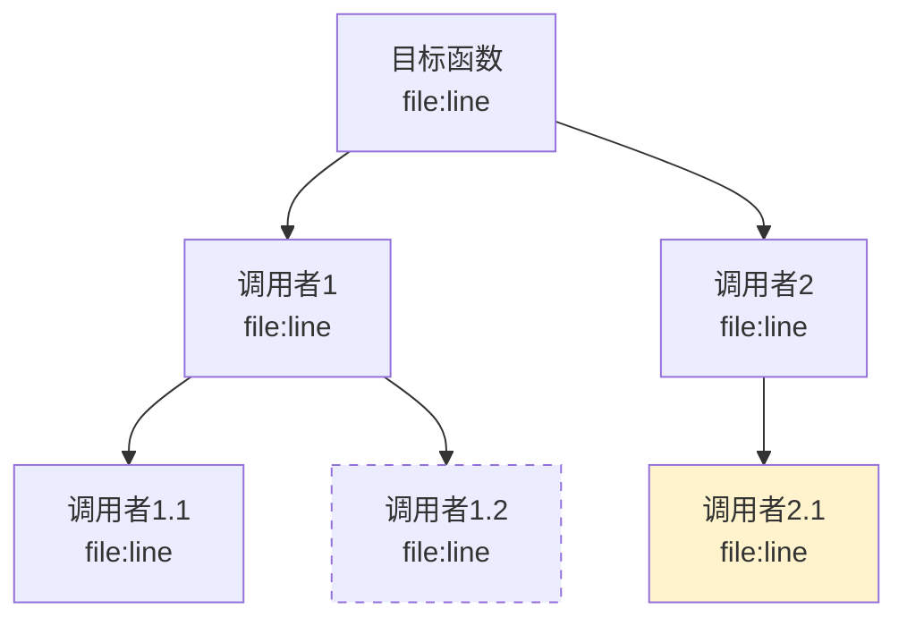

# 影响面分析指南

## 概述

影响面分析从单个函数出发，追踪调用链的上下游传播，评估修改该函数后对系统的影响范围，并给出改动建议。

## 追踪策略

### 深度控制

用户在阶段 I2 选择的深度决定了递归层数：

| 选项 | 深度 | 适用场景 |
|------|------|---------|
| A) 直接调用者 | 1 层 | 快速了解谁在用这个函数 |
| B) 3 层递归 | 3 层 | 理解中等范围的影响 |
| C) 完整传播 | 不限 | 全面评估（可能耗时较长） |

完整传播模式的终止条件：
- 到达 `main` 函数或事件循环入口
- 到达测试文件（标记为 `[测试]`）
- 到达第三方库代码（标记为 `[第三方]`）
- 递归深度超过 10 层（标记为 `[截断]`）
- 同一函数重复出现（检测循环调用，标记为 `[循环]`）

### 正向追踪（函数调用了谁）

```
function traceForward(func, depth, maxDepth):
    callers = findReferences(func) → 筛选调用点
    for each 调用点:
        target = goToDefinition(调用点)
        记录: {调用者: func, 被调用者: target, 位置: 调用点, 条件: 调用上下文}
        if depth < maxDepth:
            traceForward(target, depth + 1, maxDepth)
```

### 反向追踪（谁调用了这个函数）

```
function traceBackward(func, depth, maxDepth):
    refs = findReferences(func的定义位置)
    callers = refs → 筛选类型为 reference → 反查所在函数名
    for each caller:
        记录: {调用者: caller, 被调用者: func, 位置: ref位置}
        if depth < maxDepth:
            traceBackward(caller, depth + 1, maxDepth)
```

## 影响传播树构建

### 数据结构

每个节点记录：
```
{
    函数签名: string
    文件路径: string
    行号: number
    方向: "正向" | "反向"
    深度: number
    标签: string[]  // [测试], [第三方], [截断], [循环], [跨模块]
}
```

### 输出格式

文本树（对话输出）：
```
影响函数: {签名} ({文件}:{行})
├── [直接调用者] {函数1} ({文件}:{行})
│   ├── [间接调用者] {函数2} ({文件}:{行})
│   └── [间接调用者] {函数3} ({文件}:{行}) [跨模块]
└── [直接调用者] {函数4} ({文件}:{行}) [测试]
```

Mermaid 图（文档输出）：


## 改动建议生成

### 分析框架

根据函数的调用特征，判断不同修改方式的影响：

#### 修改函数签名（参数变化）

影响面：所有直接调用者
分析方法：
1. 列出所有直接调用者（反向追踪 1 层）
2. 对每个调用者，分析它如何构造参数（读调用点上下文）
3. 评估修改难度：参数是字面量（容易改）还是来自复杂表达式（改动面大）

#### 修改返回值语义

影响面：所有使用返回值的调用者
分析方法：
1. 对每个直接调用者，读调用点上下文
2. 检查返回值是否被使用（赋值给变量、作为条件判断、传递给其他函数）
3. 如果返回值未被使用 → 不受影响
4. 如果返回值被使用 → 标记为受影响，分析具体使用方式

#### 修改内部行为（不改接口）

影响面：依赖行为语义的调用者（间接影响）
分析方法：
1. 检查是否有调用者依赖函数的副作用（全局状态修改、日志输出顺序）
2. 检查是否有调用者依赖函数的时序行为
3. 标记为低/中/高风险

#### 添加新参数（带默认值）

影响面：最小
分析方法：
1. 确认语言是否支持默认参数（C++ 支持，C 不支持）
2. 如果支持 → 大部分调用者无需修改，仅检查是否有函数指针传递的场景
3. 如果不支持 → 等同于修改函数签名

### 建议模板

```markdown
### 推荐修改方式
基于影响面分析，推荐 {方式}，原因：{分析}

### 需要同步修改的文件
| 文件 | 行号 | 修改内容 | 原因 |
|------|------|---------|------|

### 建议新增的测试点
- {调用路径描述} → 验证 {预期行为}
- {边界条件} → 验证 {预期行为}
```

## 性能控制

### 大量引用的函数

某些公共函数可能有数百个引用（如日志函数、工具函数）。处理策略：

1. **引用数 > 100**：不逐个分析，改为：
   - 统计按模块分布的调用数量
   - 只深入分析核心模块的调用者
   - 其他模块只列出统计数字
2. **引用数 > 500**：警告用户，建议缩小分析范围

### LSP 调用频率控制

- 避免对同一函数重复调用 `findReferences`（缓存结果）
- 同一文件的 `documentSymbol` 只调用一次
- 优先批量处理同一文件内的多个 `goToDefinition` 调用
